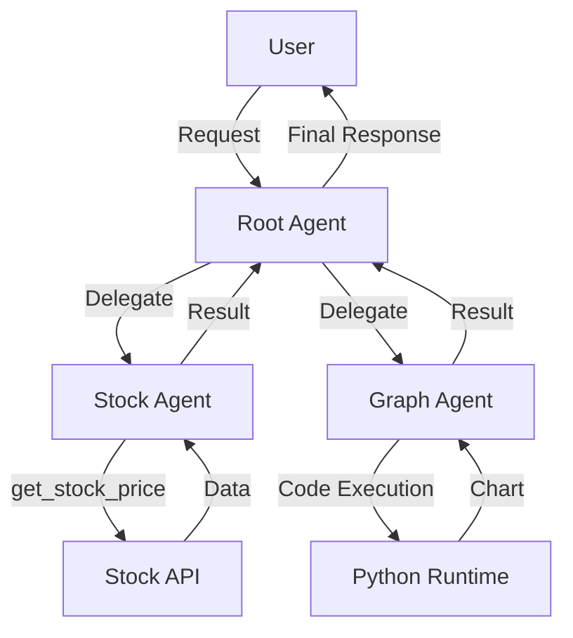

# 🤝 Understanding Multi-Agent Systems

## What is Multi-Agent Orchestration?

A **multi-agent system** consists of multiple specialized AI agents working together, coordinated by a **manager/root agent**.

Think of it like a company:
- 🎯 **Manager Agent**: The CEO who delegates tasks
- 👨‍💼 **Sub-Agents**: Specialized employees (finance expert, data analyst, etc.)

---

## Why Use Multiple Agents?

### Single Agent Limitations

A single agent with many tools can become:
- 😵 **Confused**: Too many tools to choose from
- 🐌 **Slow**: Must consider all tools for every decision
- 🔀 **Unfocused**: Jack of all trades, master of none

### Multi-Agent Benefits

| Benefit | Description | Example |
|---------|-------------|---------|
| **Specialization** | Each agent is an expert in one domain | Stock agent only handles financial data |
| **Clarity** | Clear separation of responsibilities | Graph agent only creates visualizations |
| **Scalability** | Easy to add new capabilities | Add a weather agent without changing others |
| **Maintainability** | Changes to one agent don't affect others | Update stock API without touching graph code |

---

## Architecture Pattern

```
┌─────────────────────────────────────────┐
│         USER REQUEST                    │
│  "Get AAPL price and create a chart"    │
└──────────────┬──────────────────────────┘
               │
               ▼
┌─────────────────────────────────────────┐
│       ROOT AGENT (Manager)              │
│  - Analyzes the request                 │
│  - Decides which sub-agents to use      │
│  - Coordinates the workflow             │
└──────┬──────────────────────┬───────────┘
       │                      │
       ▼                      ▼
┌──────────────┐      ┌──────────────┐
│ STOCK AGENT  │      │ GRAPH AGENT  │
│ - Fetches    │      │ - Creates    │
│   stock data │      │   chart      │
└──────┬───────┘      └──────┬───────┘
       │                      │
       └──────────┬───────────┘
                  ▼
       ┌─────────────────────┐
       │   FINAL RESPONSE    │
       │  "AAPL: $180.50     │
       │   [ASCII Chart]"    │
       └─────────────────────┘
```

---

## The Delegation Process

### Step 1: User Request
```
User: "Get me the stock price for AAPL and create a chart"
```

### Step 2: Root Agent Analysis
```
Root Agent (thinking):
- This request has two parts:
  1. Get stock price → Delegate to Stock Agent
  2. Create chart → Delegate to Graph Agent
- I need to coordinate both agents in sequence
```

### Step 3: First Delegation
```
Root Agent → Stock Agent: "Get the price for AAPL"
Stock Agent: [Calls get_stock_price("AAPL")]
Stock Agent → Root Agent: "AAPL is $180.50"
```

### Step 4: Second Delegation
```
Root Agent → Graph Agent: "Create a chart for AAPL at $180.50"
Graph Agent: [Executes code to generate chart]
Graph Agent → Root Agent: [ASCII bar chart]
```

### Step 5: Final Response
```
Root Agent → User:
"Here's the information you requested:

Stock: AAPL
Price: $180.50
Change: +$2.30 (+1.29%)

Chart:
AAPL   $180.50 ████████████████████████████████"
```

---

## When to Use Multi-Agent vs Single-Agent

### Use Single Agent When:
- ✅ Task is simple and focused
- ✅ Only 1-3 tools needed
- ✅ No complex coordination required
- ✅ Example: "Search the web and summarize"

### Use Multi-Agent When:
- ✅ Multiple distinct domains (finance + visualization + weather)
- ✅ Complex workflows requiring coordination
- ✅ Need for specialization and expertise
- ✅ Example: "Analyze stock trends, create forecast, and visualize"

---

## Agent Specialization

Each sub-agent should be an **expert** in one area:

### Stock Agent
- 📊 **Domain**: Financial data
- 🛠️ **Tools**: `get_stock_price()`
- 🎯 **Expertise**: Understanding tickers, formatting financial data
- 📝 **Instructions**: Focus on stock market terminology

### Graph Agent
- 📈 **Domain**: Data visualization
- 🛠️ **Tools**: Code execution
- 🎯 **Expertise**: Creating charts, formatting data visually
- 📝 **Instructions**: Focus on clear, readable visualizations

### Root Agent
- 🎯 **Domain**: Task coordination
- 🛠️ **Tools**: Sub-agents (not traditional tools!)
- 🎯 **Expertise**: Understanding requests, delegating appropriately
- 📝 **Instructions**: Focus on when to use each sub-agent

---

## Communication Flow



---

## Your Exercise

In this exercise, you'll:

1. ✅ **Complete Stock Agent** (`stock_agent.py`)
   - Fill in tool description for `get_stock_price()`
   - Write instructions for the stock specialist

2. ✅ **Complete Graph Agent** (`graph_agent.py`)
   - Write instructions for the visualization specialist
   - Understand code execution capability

3. ✅ **Complete Root Agent** (`root_agent.py`)
   - Write delegation instructions
   - Register sub-agents in the array

4. ✅ **Test Multi-Agent Coordination**
   - See how the root agent delegates tasks
   - Watch agents work together

---

## Testing Your Multi-Agent System

Once you've completed the code, run:

```bash
cd multi_agent
adk web-port 8000
```

Try these prompts:

### Simple Delegation
- ✅ "What's the stock price for AAPL?" → Stock Agent only
- ✅ "Create a chart for AAPL: $180.50" → Graph Agent only

### Complex Coordination
- ✅ "Get AAPL stock price and create a chart" → Both agents
- ✅ "Compare AAPL, GOOGL, and MSFT prices with a visualization" → Multiple calls + graph

### Watch For:
- 🔍 How the root agent analyzes the request
- 📤 Which sub-agent(s) it delegates to
- 🔄 How it coordinates multiple agents
- 📊 The final combined response

---

## Design Patterns

### Pattern 1: Sequential Delegation
```
Request → Agent A → Agent B → Response
Example: Get data, then visualize it
```

### Pattern 2: Parallel Delegation
```
Request → Agent A ↘
              ↓    → Combine → Response
Request → Agent B ↗
Example: Get multiple stock prices simultaneously
```

### Pattern 3: Conditional Delegation
```
Request → Analyze → If condition A: Agent A
                  → If condition B: Agent B
Example: Route to appropriate specialist based on request type
```

---

## Best Practices

### 1. Clear Responsibilities
Each agent should have a **single, well-defined purpose**.

❌ Bad: "Stock and weather agent"
✅ Good: Separate stock agent and weather agent

### 2. Descriptive Instructions
Root agent needs to know **when** to use each sub-agent.

❌ Bad: "You have sub-agents"
✅ Good: "Use Stock Agent for financial data, Graph Agent for visualizations"

### 3. Minimal Tool Overlap
Avoid giving the same tool to multiple agents.

❌ Bad: Both agents have `get_stock_price()`
✅ Good: Only Stock Agent has `get_stock_price()`

### 4. Coordination Logic
Root agent should handle **workflow**, not domain logic.

❌ Bad: Root agent calculates stock trends
✅ Good: Root agent delegates to Stock Agent for calculations

---

## Key Takeaways

1. 🤝 **Multi-agent = Specialization**: Each agent is an expert
2. 🎯 **Root agent = Coordinator**: Delegates but doesn't do the work
3. 📊 **Clear boundaries**: Each agent has distinct responsibilities
4. 🔄 **Flexible workflows**: Can coordinate simple or complex tasks
5. 📈 **Scalable**: Easy to add new specialized agents

---

## Real-World Applications

Multi-agent systems are used for:

- 🏦 **Financial Analysis**: Data retrieval + analysis + visualization
- 🏥 **Healthcare**: Diagnosis + treatment planning + scheduling
- 🛒 **E-commerce**: Product search + recommendations + checkout
- 📰 **Content Creation**: Research + writing + editing + formatting
- 🎮 **Game AI**: Strategy + tactics + resource management

---

**Congratulations!** You've completed the multi-agent exercise. You now understand how to build sophisticated AI systems with specialized, coordinated agents! 🎉

**Next Steps:**
- Experiment with adding new sub-agents (weather, news, etc.)
- Try more complex coordination patterns
- Build your own multi-agent application!
